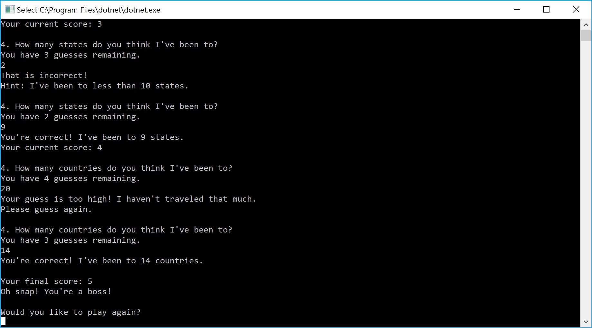

# Lab01-About-Me-Quiz
Author: Earl Jay Caoile
Version: 1.0.0

## The purpose of the program
This program is designed to quiz the user on information about me (Earl Jay Caoile). It gives 5 questions, and a few of them allow for multiple attempts. After each question, your total score is given. At the end, a final score is given with an option to play again.

As an assignment, this lab gave me a opportunity to practice basic C# syntax and get used to creating functions with different return types.

## How to run the program
- Ensure you have the following installed:
  - Visual Studio 2017 Community
  - .NET Core 2.1 RC SDK
  - Git Bash if running Windows
- Clone the repository from GitHub to your desired directory using the clone or download link provided at the top right area of the main repository page
- Open the solution file (found in Lab01-About-Me-Quiz\Lab01_About_Me\Lab01_About_Me.sln)
- Once the solution file is open in Visual Studio, hit the green play button to run the program

## What the program should look like

